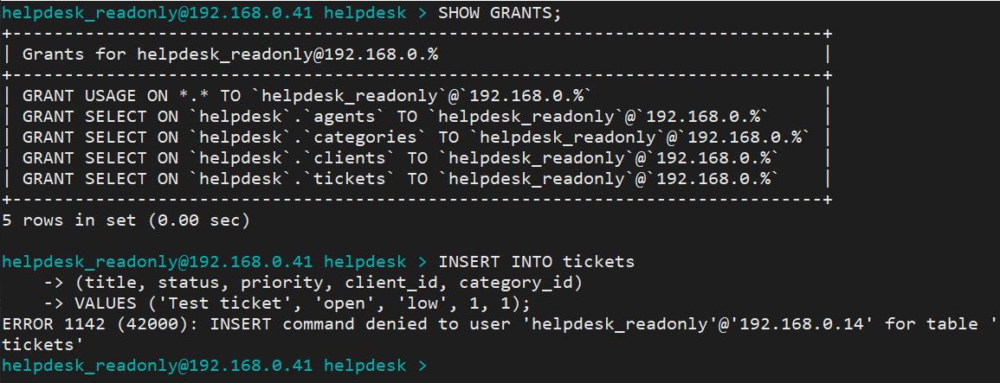
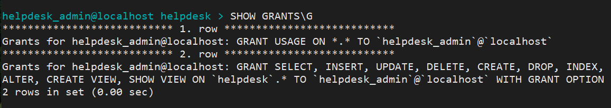
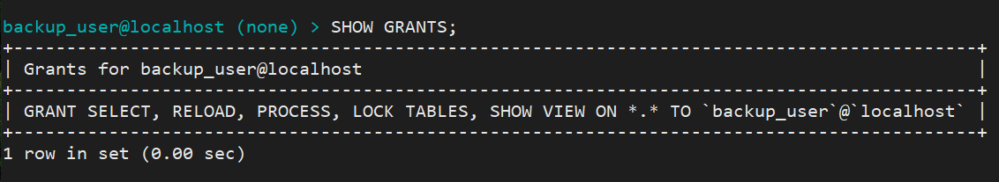
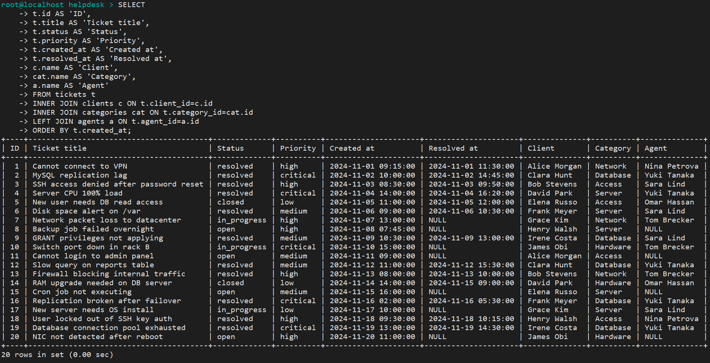
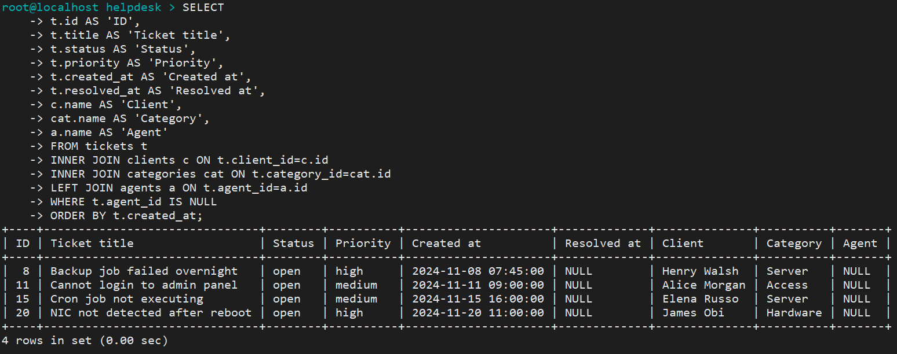
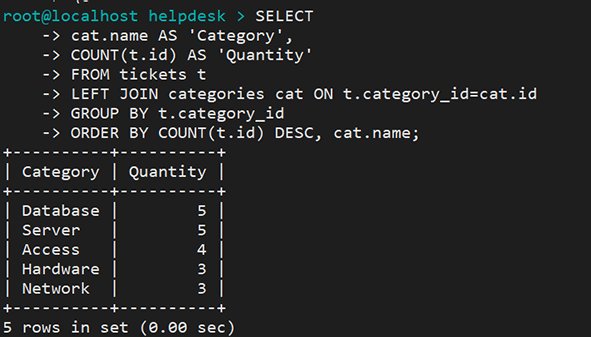
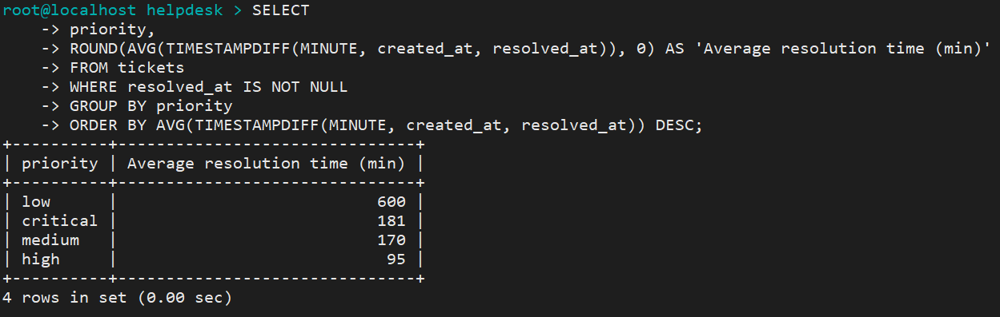
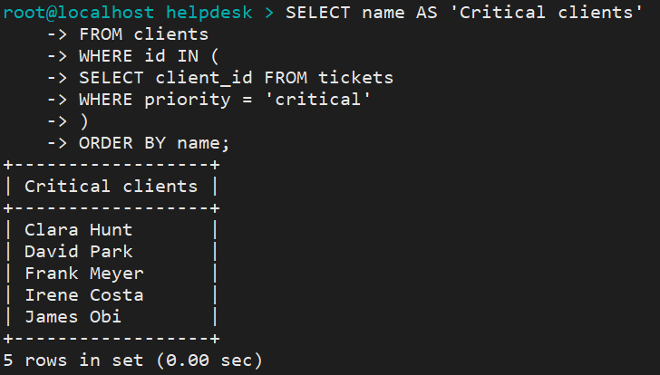
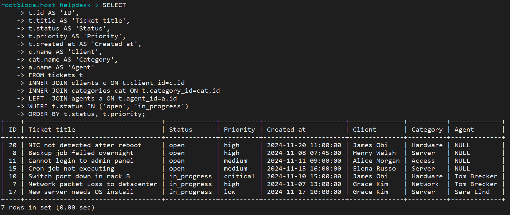

# MySQL Helpdesk Database

Practice environment for MySQL administration tasks.
Built on Oracle Linux 9, MySQL 8.0.

## Stack

- OS: Oracle Linux 9
- DB: MySQL 8.0
- Theme: helpdesk ticketing system (tickets, clients, categories, agents)

## Quick Start

Run scripts in this order:

````bash
# 1. Create database and tables
mysql -u root -p < schema.sql

# 2. Load sample data
mysql -u root -p helpdesk < seed.sql

# 3. Create users and set privileges
mysql -u root -p < users_and_privileges.sql

# 4. Run demo queries
mysql -u root -p helpdesk < demo_queries.sql
# For formatted output, run queries interactively in the MySQL client.
````

## Verifying Users and Privileges

Connect from localhost (via SSH):

```bash
mysql -u helpdesk_admin -p'PasswdAdmin!2'
mysql -u backup_user -p'PasswdBackup!3'
```

Connect from another VM on the same LAN:

```bash
mysql -u helpdesk_readonly -h 192.168.0.41 -p'PasswdReadonly!0'
mysql -u helpdesk_agent -h 192.168.0.41 -p'PasswdAgent!1'
```

> **Note:** Passwords are shown here for lab demonstration only.
> In production, use `.my.cnf` or environment variables — never hardcode credentials in commands or scripts.

After connecting, verify access:

```sql
SHOW GRANTS;
USE helpdesk;
SHOW TABLES;
```

## Sample Output: Users and Privileges

### helpdesk_readonly: grants and access denied
Shows granted privileges and failed INSERT attempt — read-only restrictions enforced at table level.


### SHOW GRANTS: helpdesk_admin


### SHOW GRANTS: backup_user


## Backup

````bash
# Run manually
bash backup.sh

# Or schedule via cron (daily at 2:00 AM)
0 2 * * * /path/to/backup.sh
````

## Files

| File | Description |
|------|-------------|
| `schema.sql` | Database schema: CREATE DATABASE, CREATE TABLE |
| `seed.sql` | Sample data: 10 clients, 5 categories, 5 agents, 20 tickets |
| `users_and_privileges.sql` | User roles: readonly, agent, admin |
| `demo_queries.sql` | JOIN, GROUP BY, subquery examples with comments |
| `backup.sh` | Automated backup script with 7-day rotation |

## Security Notes

After MySQL installation, `sudo mysql_secure_installation` was executed:
- Anonymous users removed
- Remote root login disabled
- Test database removed

## Sample Output

All examples run in a local VM lab environment.

### All tickets with client, category, and agent

Demonstrates INNER JOIN on clients and categories, LEFT JOIN on agents.
Tickets with no assigned agent show NULL in the Agent column.



### Unassigned tickets

Tickets with no agent allocated yet.
Demonstrates LEFT JOIN on agents table and WHERE agent_id IS NULL filter.



### Ticket count by category

Ticket volume per category, busiest first.
Demonstrates GROUP BY with COUNT. Categories with equal count are sorted alphabetically.



### Average resolution time by priority

Shows mean resolution time per priority level. Open tickets are excluded.
Demonstrates AVG with TIMESTAMPDIFF and GROUP BY.



### Clients with at least one critical ticket

Demonstrates a subquery with IN operator.



### Open and in-progress tickets by priority

Active tickets grouped by status and sorted by priority.
Demonstrates WHERE IN with ORDER BY on multiple columns.

